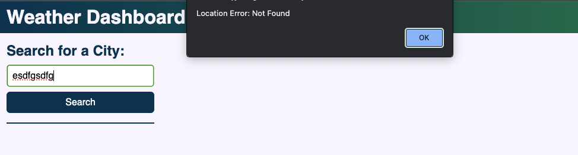

# Weather Dashboard
Weather Application for users to search for a city and see the current weather and a five day forecast.

## Description
### What was your motivation?
I wanted to create a simple web app for the user to search for weather in various locations. This code has been created from scratch.

### Why did you build this project?
To develop and practise working with third party and server side APIs.

### What problem does it solve?
This app allows the user to see the weather in their chosen location, see their previous searches and re-search their results.

### What did you learn?
1. How to source data from APIs
2. Learning how to read API documentation
3. Developing me js skill to create html and CSS elements with js.
4. Using external CSS libraries for some of the features/ 

## Installation
FIXME:

## Usage
Weather Dashboard landing page:

If the user types in a location that doesn't exist, they will recieve an alert message:

When user searches for a city they can see the current weather and the 5 day forecast.

FIXME: Weather Dashboard - Current weather and 5 day forecast for XXX visible for user to see.

Once the user has searched for multiple cities, that can see their previous searches in the aide. These are also buttons to allowe the user to re-search.

FIXME: Weather Dashboard - Current weather and 5 day forecast for XXX visible in the main body of site as well as previous searches visible in the aside.

## Future Developments
1. Look at previous searches cancelling out if it is already visible, so that there are not souble buttons. 

## Credits
#### Weather API Resources:
https://openweathermap.org/current
https://openweathermap.org/api/geocoding-api
https://openweathermap.org/forecast5
https://openweathermap.org/weather-conditions
https://openweathermap.org/weather-conditions#Weather-Condition-Codes-2

#### General API Resources:
https://developer.mozilla.org/en-US/docs/Web/API/Response/ok
https://day.js.org/docs/en/display/format

#### CSS Resources:
https://getbootstrap.com/docs/5.2/components/card/
https://getbootstrap.com/docs/5.2/components/buttons/

#### JavaScript Resources:
https://developer.mozilla.org/en-US/docs/Web/JavaScript/Reference/Global_Objects/String/split

## License
MIT License